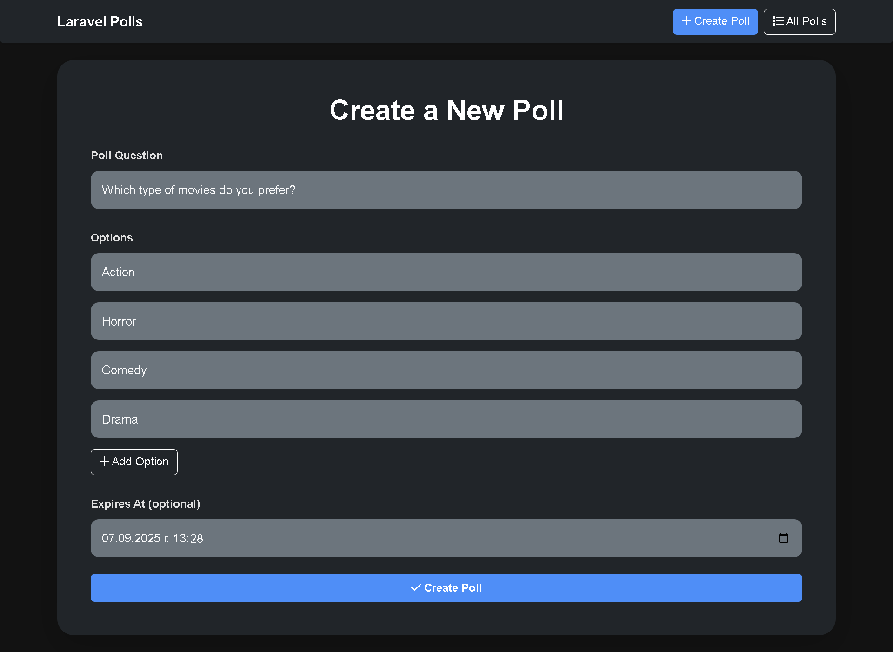
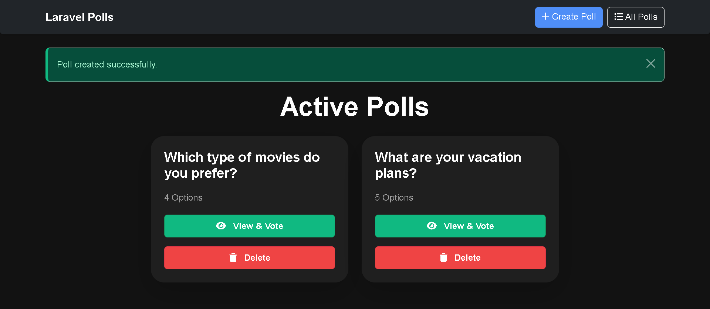
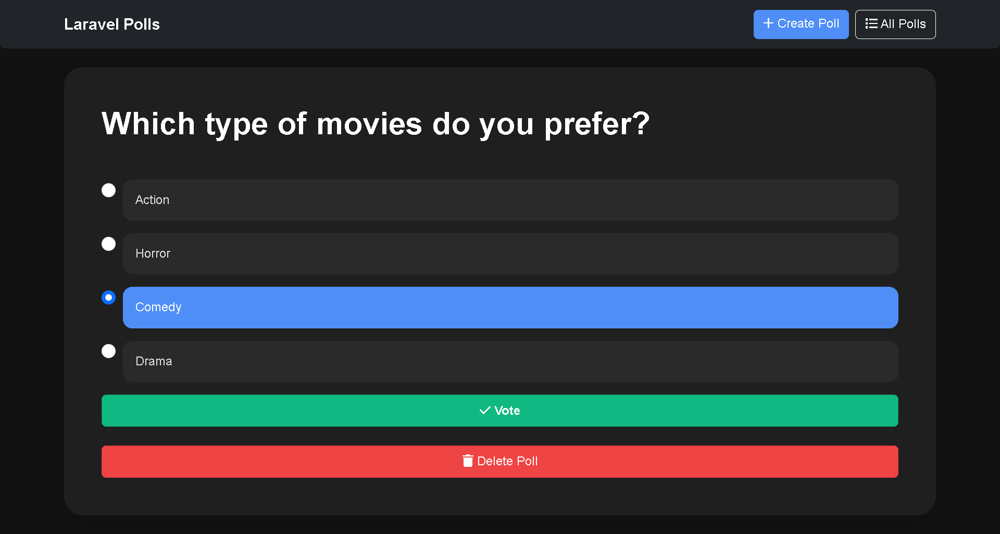
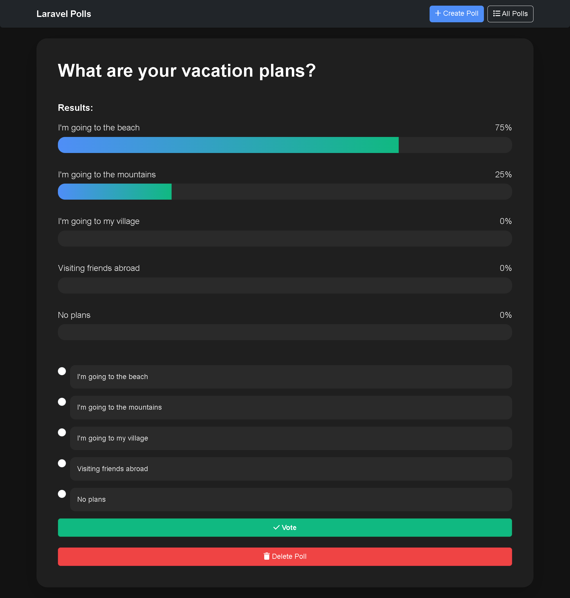
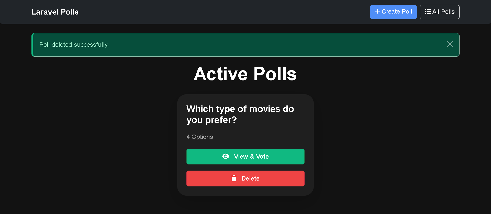
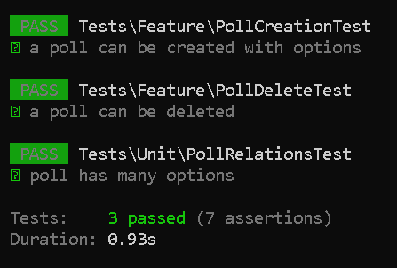

# Laravel Polls Project

A simple Laravel application that allows users to create polls, vote on them, and view results.

---

## Features

* Create polls with a question and multiple options.
* Vote on polls.
* View poll results with vote counts.
* Delete polls.
* Built with Laravel 12, Bootstrap 5, and SQLite.

---

## Requirements

* PHP 8.2 or higher
* Composer
* SQLite

> **Note:** The app runs using Laravel's built-in development server.

---

## Installation

1. **Clone the repository:**

```bash
git clone https://github.com/alexyusnyu/Laravel-Polls-Project
cd Laravel-Polls-Project
```

2. **Install dependencies:**

```bash
composer install
```

3. **Set up environment file:**

*For Linux/macOS
```bash
cp .env.example .env
```

*For Windows
```bash
copy .env.example .env
```

4. **Configure the database:**

Open `.env` and set:

```env
DB_CONNECTION=sqlite
DB_DATABASE=absolute/path/to/Laravel-Polls-Project/database/database.sqlite
DB_FOREIGN_KEYS=true
```

Create the SQLite database file:

*For Linux/macOS

```bash
touch database/database.sqlite
```

*For Windows:
```bash
type nul > database\database.sqlite
```

5. **Generate the application key:**

```bash
php artisan key:generate
```

6. **Run migrations and seed the database:**

```bash
php artisan migrate --seed
```

---

## Running the Application

Start the development server:

```bash
php artisan serve
```

Open your browser and visit: [http://127.0.0.1:8000](http://127.0.0.1:8000)

You should see the polls list, be able to create new polls, vote, and view results.

---

## Project Structure

* `app/Models` — Contains `Poll`, `Option`, `Vote` models.
* `app/Http/Controllers` — Contains `PollController` and `VoteController`.
* `database/migrations` — Migrations for `polls`, `options`, `votes` tables.
* `database/seeders` — Example poll and test user seeding.
* `resources/views/polls` — Blade templates for index, create, and show poll pages.
* `routes/web.php` — Application routes.
* `tests/Unit` — Unit tests.
---

Unit Tests

The project includes the following tests:

PollRelationsTest — Unit test to ensure a poll has many options.

PollCreationTest — Feature test to verify polls can be created with options.

PollDeleteTest — Feature test to verify polls can be deleted successfully.

To run all tests:

```bash
php artisan test
```


## Screenshots













